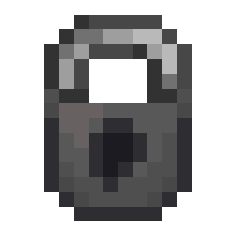

# Assembly

[>> Downloads <<](https://github.com/cottonmc/Assembly/releases)

*Lock things up!*

**This mod is open source and under a permissive license.** As such, it can be included in any modpack on any platform without prior permission. We appreciate hearing about people using our mods, but you do not need to ask to use them. See the [LICENSE file](LICENSE) for more details.

Assembly is, currently, a minimum-viable product for testing the Cotton suite. It will be expanded further as the suite is developed.
